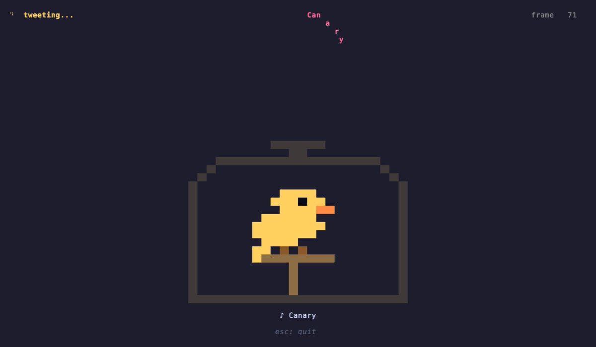

# canary

elm/tea inspired tui in guile. see `DESIGN.md` for architecture,
`examples/canary-tweet.scm` for a worked example.



## run

### linux (guix)

```sh
guix shell -m manifest.scm -- guile -L . examples/canary-tweet.scm
```

`manifest.scm` pins `guile-next`, `guile-fibers`, `gcc-toolchain`,
`gnu-make`, `git`.

### macos

```sh
brew install guile guile-fibers
```

homebrew's guile doesn't auto-add its site dirs to the load path, so
export them (per `brew info guile`):

```sh
export GUILE_LOAD_PATH=/opt/homebrew/share/guile/site/3.0
export GUILE_LOAD_COMPILED_PATH=/opt/homebrew/lib/guile/3.0/site-ccache
export GUILE_SYSTEM_EXTENSIONS_PATH=/opt/homebrew/lib/guile/3.0/extensions
```

then:

```sh
guile -L . examples/canary-tweet.scm
```

## make

| target         |                                                   |
|----------------|---------------------------------------------------|
| `make compile` | guild compile `canary/*.scm` to `build/canary/*.go` |
| `make test`    | run `tests/test-*.scm` under srfi-64              |
| `make lint`    | reject ansi escapes outside backend-ansi/terminal |
| `make repl`    | `guile --listen=37147` for geiser                 |
